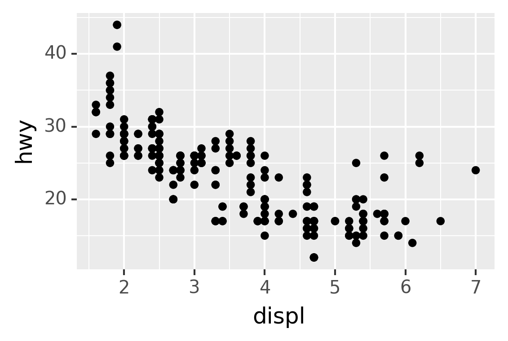
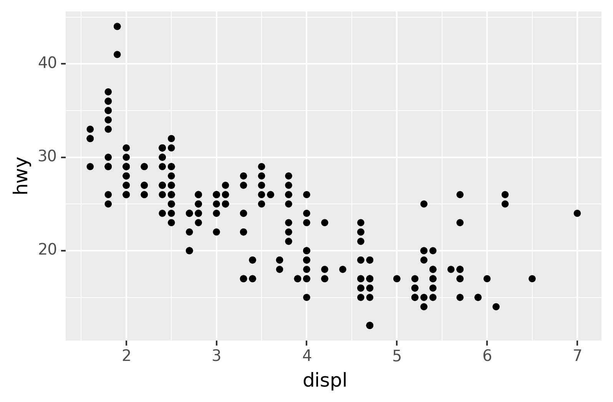
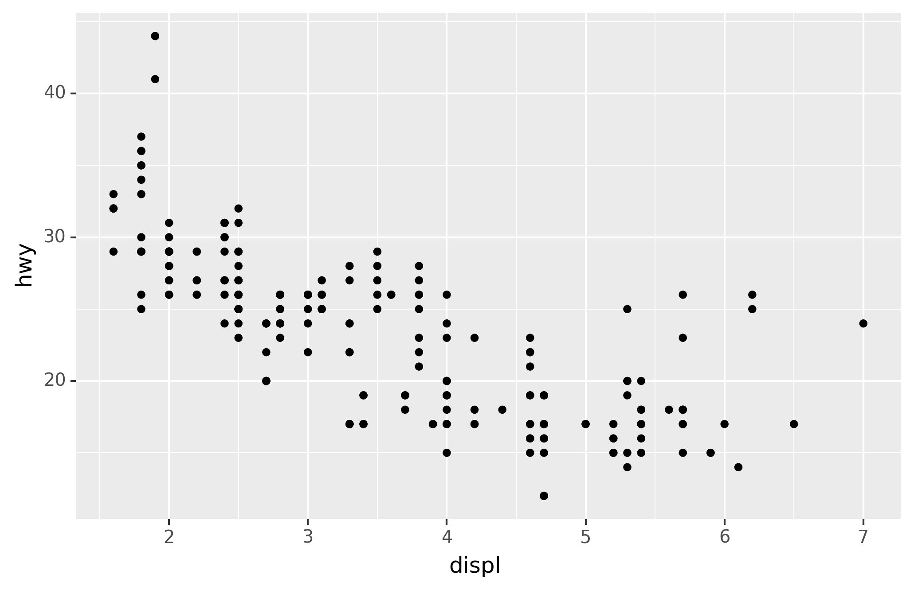

# Graphics for communication

```{r, echo=FALSE}
library(reticulate)
use_virtualenv("./pyenv", required = TRUE)
knitr::opts_chunk$set(fig.show = "hold",
                      fig.align = "center",
                      out.extra = "class=\"md:w-3/4 lg:w-2/3\"",
                      dpi = 300,
                      results = "hide",
                      comment = "")
```


```{python echo=FALSE}
from plotnine import *
from plotnine.data import *

import numpy as np
import pandas as pd
```

```{python, echo=FALSE}
import warnings
pd.set_option("display.max_rows", 10)

from matplotlib import rcParams
rcParams.update({"figure.max_open_warning": 0,
                 "savefig.bbox": "tight"})

theme_set(theme_gray(base_size=12))
```


## Introduction

Now that you understand your data, you need to _communicate_ your understanding to others. Your audience will likely not share your background knowledge and will not be deeply invested in the data. To help others quickly build up a good mental model of the data, you will need to invest considerable effort in making your plots as self-explanatory as possible. In this chapter, you'll learn some of the tools that plotnine provides to do so.

The rest of this tutorial focuses on the tools you need to create good graphics. I assume that you know what you want, and just need to know how to do it. For that reason, I highly recommend pairing this chapter with a good general visualisation book. I particularly like [_The Truthful Art_](https://amzn.com/0321934075), by Albert Cairo. It doesn't teach the mechanics of creating visualisations, but instead focuses on what you need to think about in order to create effective graphics.

## Labels

The easiest place to start when turning an exploratory graphic into an expository graphic is with good labels. You add labels with the `labs()` function. This example adds a plot title:

```{python, message=FALSE}
ggplot(mpg, aes("displ", "hwy")) +\
geom_point(aes(color="class")) +\
geom_smooth(se=False) +\
labs(title="Fuel efficiency generally decreases with engine size")
```

The purpose of a plot title is to summarise the main finding. Avoid titles that just describe what the plot is, e.g. "A scatterplot of engine displacement vs. fuel economy".

You can also use `labs()` to replace the axis and legend titles.^[In ggplot2, you can also use `labs()` to add a subtitle and a caption.] It's usually a good idea to replace short variable names with more detailed descriptions, and to include the units.

```{python, message=FALSE}
ggplot(mpg, aes("displ", "hwy")) +\
geom_point(aes(colour="class")) +\
geom_smooth(se=False) +\
labs(x="Engine displacement (L)",
     y="Highway fuel economy (mpg)",
     colour="Car type")
```

It's possible to use mathematical equations instead of text strings. You have to tell matplotlib, which is used by plotnine to do the actuall plotting, to use LaTeX for rendering text:

```{python}
from matplotlib import rc
rc('text', usetex=True)

df = pd.DataFrame({"x": np.random.uniform(size=10),
                   "y": np.random.uniform(size=10)})

ggplot(df, aes("x", "y")) +\
geom_point() +\
labs(x="$\\sum_{i = 1}^n{x_i^2}$",
     y="$\\alpha + \\beta + \\frac{\\delta}{\\theta}$")
```

```{python, echo=FALSE}
rc('text', usetex=False)
```

See [the matplotlib documentation](https://matplotlib.org/3.1.1/tutorials/text/mathtext.html) for more information about how to write mathematical equations using LaTeX.

### Exercises

1.  Create one plot on the fuel economy data with customised `title`, `x`, `y`, and `colour` labels.

1.  The `geom_smooth()` is somewhat misleading because the `hwy` for large engines is skewed upwards due to the inclusion of lightweight sports cars with big engines. Use your modelling tools to fit and display a better model.

1.  Take an exploratory graphic that you've created in the last month, and add an informative title to make it easier for others to understand.


## Annotations

In addition to labelling major components of your plot, it's often useful to label individual observations or groups of observations. The first tool you have at your disposal is `geom_text()`. `geom_text()` is similar to `geom_point()`, but it has an additional aesthetic: `label`. This makes it possible to add textual labels to your plots.

There are two possible sources of labels. First, you might have a DataFrame that provides labels. The plot below isn't terribly useful, but it illustrates a useful approach: pull out the most efficient car in each class with pandas, and then label it on the plot:

```{python}
best_in_class = mpg\
.sort_values(by="hwy", ascending=False)\
.groupby("class")\
.first()

ggplot(mpg, aes("displ", "hwy")) +\
geom_point(aes(colour="class")) +\
geom_text(aes(label="model"), data=best_in_class)
```


This is hard to read because the labels overlap with each other, and with the points. We can make things a little better by switching to `geom_label()` which draws a rectangle behind the text. We also use the `nudge_y` parameter to move the labels slightly above the corresponding points:

```{python}
ggplot(mpg, aes("displ", "hwy")) +\
geom_point(aes(colour="class")) +\
geom_label(aes(label="model"), data=best_in_class, nudge_y=2, alpha=0.5)
```

That helps a bit, but if you look closely in the top-left hand corner, you'll notice that there are two labels practically on top of each other. This happens because the highway mileage and displacement for the best cars in the compact and subcompact categories are exactly the same. There's no way that we can fix these by applying the same transformation for every label. Instead, we can use the adjust_text argument. This useful argument, which employs the adjustText package under the hood, will automatically adjust labels so that they don't overlap:

```{python}
ggplot(mpg, aes("displ", "hwy")) +\
geom_point(aes(colour="class")) +\
geom_point(data=best_in_class, fill='none') +\
geom_label(aes(label="model"), data=best_in_class, adjust_text={
    'expand_points': (1.5, 1.5),
    'arrowprops': {
        'arrowstyle': '-'
    }})
```

Note another handy technique used here: I added a second layer of large, hollow points to highlight the points that I've labelled.

You can sometimes use the same idea to replace the legend with labels placed directly on the plot. It's not wonderful for this plot, but it isn't too bad.^[We have to use `geom_point()` twice here because of an [issue](https://github.com/has2k1/plotnine/issues/324]) with the adjustText package.]
(`theme(legend_position="none"`) turns the legend off --- we'll talk about it more shortly.)

```{python}
class_avg = mpg\
.groupby("class")["displ","hwy"].median()\
.reset_index()

ggplot(mpg, aes("displ", "hwy", colour="class")) +\
geom_point() +\
geom_label(aes(label="class"), data=class_avg, size=16, label_size=0, adjust_text={'expand_points': (0, 0)}) +\
geom_point() +\
theme(legend_position="none")
```


Alternatively, you might just want to add a single label to the plot, but you'll still need to create a DataFrame. Often, you want the label in the corner of the plot, so it's convenient to create a new DataFrame using `pd.DataFrame()` and `max()` to compute the maximum values of x and y.

```{python} 
label = pd.DataFrame({"displ": [mpg.displ.max()],
                      "hwy": [mpg.hwy.max()],
                      "label": "Increasing engine size is \nrelated to decreasing fuel economy."})

ggplot(mpg, aes("displ", "hwy")) +\
geom_point() +\
geom_text(aes(label="label"), data=label, va="top", ha="right")
``` 

If you want to place the text exactly on the borders of the plot, you can use `+np.Inf` and `-np.Inf`:

```{python} 
label = pd.DataFrame({"displ": [np.Inf],
                      "hwy": [np.Inf],
                      "label": "Increasing engine size is \nrelated to decreasing fuel economy."})

ggplot(mpg, aes("displ", "hwy")) +\
geom_point() +\
geom_text(aes(label="label"), data=label, va="top", ha="right")
``` 

In these examples, I manually broke the label up into lines using `"\n"`. Another approach is to use the `fill` function from the `textwrap` module to automatically add line breaks, given the number of characters you want per line:

```{python}
from textwrap import fill

print(fill("Increasing engine size is related to decreasing fuel economy.", width=40))
```

Note the use of `ha` and `va` to control the alignment of the label. The figure below shows all nine possible combinations.

```{python, echo=FALSE}
from itertools import product

has = ["left", "center", "right"]
vas = ["top", "center", "bottom"]
xs = [0, 0.5, 1]
ys = [1, 0.5, 0]

df = pd.DataFrame([{"x": xs[x],
                    "y": ys[y],
                    "ha": has[x],
                    "va": vas[y],
                    "label": f"ha=\"{has[x]}\"\nva=\"{vas[y]}\""}
                   for x, y in product(range(3), repeat=2)])

ggplot(df, aes("x", "y")) +\
geom_point(colour="grey", size=5) +\
geom_point(size=0.5, colour="red") +\
geom_text(aes(label="label", ha="ha", va="va")) +\
labs(x=None, y=None)
```

Remember, in addition to `geom_text()`, you have many other geoms in plotnine available to help annotate your plot. A few ideas:

*   Use `geom_hline()` and `geom_vline()` to add reference lines. I often make
    them thick (`size=2`) and white (`colour="white"`), and draw them
    underneath the primary data layer. That makes them easy to see, without
    drawing attention away from the data.

*   Use `geom_rect()` to draw a rectangle around points of interest. The
    boundaries of the rectangle are defined by aesthetics `xmin`, `xmax`,
    `ymin`, `ymax`.

*   Use `geom_segment()` with the `arrow` argument to draw attention
    to a point with an arrow. Use aesthetics `x` and `y` to define the
    starting location, and `xend` and `yend` to define the end location.

The only limit is your imagination (and your patience with positioning annotations to be aesthetically pleasing)!


### Exercises

1.  Use `geom_text()` with infinite positions to place text at the
    four corners of the plot.

1.  Read the documentation for `annotate()`. How can you use it to add a text
    label to a plot without having to create a DataFrame?

1.  How do labels with `geom_text()` interact with faceting? How can you
    add a label to a single facet? How can you put a different label in
    each facet? (Hint: think about the underlying data.)

1.  What arguments to `geom_label()` control the appearance of the background
    box?

1.  What are the four arguments to `arrow()`? How do they work? Create a series
    of plots that demonstrate the most important options.


## Themes


Finally, you can customise the non-data elements of your plot with a theme:

```{python}
ggplot(mpg, aes("displ", "hwy")) +\
geom_point(aes(color="class")) +\
geom_smooth(se=False) +\
theme_xkcd()
```

plotnine includes twelve themes by default. The figure below shows eight of those. The [documentation](https://plotnine.readthedocs.io/en/stable/api.html#themes) lists all available themes.

```{r, echo=FALSE, dev="png", out.extra="class=\"md:w-2/3\""}
knitr::include_graphics("images/visualization-themes.png")
```


Many people wonder why the default theme has a grey background. This was a deliberate choice because it puts the data forward while still making the grid lines visible. The white grid lines are visible (which is important because they significantly aid position judgements), but they have little visual impact and we can easily tune them out. The grey background gives the plot a similar typographic colour to the text, ensuring that the graphics fit in with the flow of a document without jumping out with a bright white background. Finally, the grey background creates a continuous field of colour which ensures that the plot is perceived as a single visual entity.

It's also possible to control individual components of each theme, like the size and colour of the font used for the y axis. Unfortunately, this level of detail is outside the scope of this book, so you'll need to read the [ggplot2 book](https://amzn.com/331924275X) for the full details. You can also create your own themes, if you are trying to match a particular corporate or journal style.


## Saving your plots

The best way to get your plots out of Python and into your final write-up^[The original text discusses how to include your plot in R Markdown. While it's possible to include Python code and graphics in an R Markdown document through the [`reticulate` package](https://rstudio.github.io/reticulate/), like this tutorial demonstrates, it's beyond the scope of this text. If you're interested, you can have a look at the [Github repository](https://github.com/datascienceworkshops/r4ds-python-plotnine) related to this tutorial, which includes the .Rmd source.)
is with the `.save()` method. There's also the `ggsave()` function, but the plotnine documentation doesn't recommend using this. The `.save()` method will save the plot to disk. In a Jupyter Notebook you can refer to the last returned value using `_`. Alternatively you first assing your plot to a variable.

```{python}
ggplot(mpg, aes("displ", "hwy")) + geom_point()
```

```python
_.save("my-plot.pdf")
```

If you don't specify the `width` and `height` they will be set to 6.4 and 4.8 inches, respectively. If you don't specify `filename`, plotnine will generate one for you, e.g., "plotnine-save-297120101.pdf". For reproducible code, you'll want to specify them. You can learn more about the `.save()` method in the documentation.


### Figure sizing

It can be a challenge to get your figure in the right size and shape. There are four options that control figure sizing: `width`, `height`, `units`, and `dpi`. 

If you find that you're having to squint to read the text in your plot, you need to tweak `width` and `height`. If the `width` is larger than the size the figure is rendered in the final doc, the text will be too small; if `width` is smaller, the text will be too big. You'll often need to do a little experimentation to figure out the right ratio between the `width` and the eventual width in your document. To illustrate the principle, the following three plots have `width` of 4, 6, and 8 respectively (and a height which is 0.618 times the width, i.e., the golden ratio):


```{python, eval=TRUE, results = "markdown"}
plot = ggplot(mpg, aes("displ", "hwy")) + geom_point()

for width in [4, 6, 8]:
    figure_save = "figure/save-width-" + str(width) + ".png"
    print(figure_save)
    plot.save(figure_save, width=width, height=width*0.618, dpi=300, verbose=False)
```

```{r, echo=FALSE, dev="png", results = "markdown"}

```

```{r, echo=FALSE, dev="png", results = "markdown"}

```

```{r, echo=FALSE, dev="png", results = "markdown"}

```
